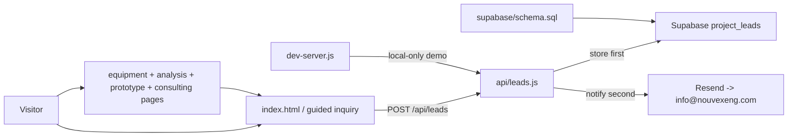

# Nouvex Repository Map

Read this file first. Load only the task-specific files listed below; do not scan hidden tool folders unless the task explicitly concerns agent tooling.

## System graph



## File ownership

| Area | Source of truth | Read with |
|---|---|---|
| Homepage and guided inquiry | `index.html` | `DESIGN.md` for visual work; `PRODUCT.md` for claims |
| Shared visual behavior | `assets/site.css`, `assets/site.js` | `DESIGN.md` |
| Capability and policy pages | `equipment.html`, `materials-analysis.html`, `prototype-design.html`, `consulting.html`, `privacy.html` | `PRODUCT.md`; preserve provisional boundaries |
| Search discovery | page metadata, `robots.txt`, `sitemap.xml` | Keep canonical URLs on `www.nouvexengineering.com` |
| Visual assets | `assets/` | Relevant references only |
| Lead API, validation, email | `api/leads.js` | `BACKEND.md` |
| Database table and access | `supabase/schema.sql` | `BACKEND.md` |
| Local service-free demo | `dev-server.js` | `BACKEND.md` |
| Vercel behavior | `vercel.json`, `.env.example` | `BACKEND.md` |
| Durable product facts | `PRODUCT.md` | Never invent proof, metrics, clients, or certifications |
| Visual system | `DESIGN.md` | Claude owns visual iteration unless coordinated otherwise |

## Task routing

- Backend/API/database/email: read `GRAPH.md`, `BACKEND.md`, `api/leads.js`, and `supabase/schema.sql`. Skip `DESIGN.md` and most of `index.html`; inspect only `sendBrief()` when the payload changes.
- Frontend behavior: read `GRAPH.md`, `assets/site.js`, and the relevant `index.html` script functions. Add `BACKEND.md` only when touching submission.
- Visual/layout/copy: read `GRAPH.md`, `PRODUCT.md`, `DESIGN.md`, and targeted `index.html` sections. Do not read backend implementation.
- Local testing: read `GRAPH.md`, `BACKEND.md`, and `dev-server.js`.
- Deployment: read `GRAPH.md`, `BACKEND.md`, `vercel.json`, and `.env.example`.

## Stable contracts

`POST /api/leads` accepts JSON:

```text
reference, challenge, focus, industry, timeline, description,
name, company, email, sourceUrl, website
```

`website` must remain empty; it is the honeypot. Successful responses contain `accepted`, `reference`, and `notificationSent`. The backend derives the route label, validates all public input, stores the lead before sending email, and keeps secrets server-side.

Frontend/backend shared boundary: `index.html` owns `sendInquiry()` and user-facing states; `api/leads.js` owns validation, persistence, notification, and HTTP responses. Coordinate before renaming payload fields.

## Commands

```powershell
graphify query "<task>" --budget 800 --graph graphify-out/graph.json
graphify update .         # refresh after structural code changes
node dev-server.js       # demo at http://127.0.0.1:4174/#scope
node --check api/leads.js
node --check dev-server.js
git diff --check
```

Demo submissions are memory-only and visible at `http://127.0.0.1:4174/api/leads`. Production requires Supabase and Resend environment variables from `.env.example`.
